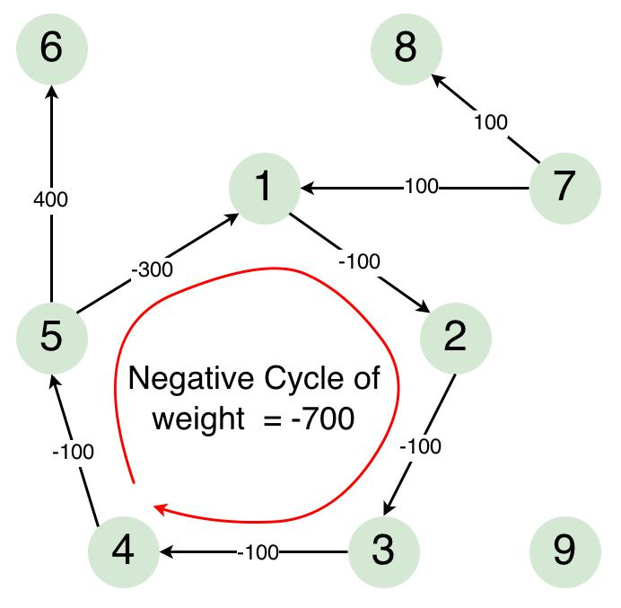

# Bellman-Ford 최단 경로 알고리즘

음수 가중치가 있는 그래프에서 특정 점으로 부터의 최소 거리를 구하기 위한 알고리즘. 모든 정점을 순회하며 각 정점에 대해서 최소거리를 기록하고 사이클이 있는지를 조사해서 최소 거리라는 것을 보장한다.(사이클이 있으면 그 사이클을 통해서 거리가 점점 줄어든다).




* #### 동작원리

  * 시작 정점의 거리는 0 나머지 정점의 거리는 무한으로 표기한다.
  * 첫 시작 노드에서 이동할 수 있는 노드들의 거리를 표기한다. 
  * 다른 노드들에게도 같은 방식으로 하되 거처갔을 때 더 짧은 거리가 나올 수 있다면 짧은 거리로 dist를 갱신한다.
  * 모든 정점을 순회한 뒤에 사이클이 발견(이동했을 때 조금 더 거리를 줄일 수 있는 경우)되면 현재까지 정해진 것들이 최소거리라는 보장이 없어지므로 답이 없다고 한다.


* #### 구현

  ```c++
  #include <iostream>
  #include <queue>
  
  #define INF 987654321
  
  int dist[9 + 1];
  int graph[9 + 1][9 + 1];
  std::queue<int> nexts;	//다음에 탐색할 노드들
  bool checker[9 + 1];
  void BellmanFordInit(int start,int nodeCount)
  {
  	for (int i = 1; i <= nodeCount; ++i)
  		for (int j = 1; j <= nodeCount; ++j)
  			graph[j][i] = INF;
  
  	for (int i = 1; i <= nodeCount; ++i)
  	{
  		dist[i] = INF;
  		checker[i] = false;
  	}
  
  	dist[start] = 0;
  	nexts.push(start);
  	checker[start] = true;
  }
  
  
  void StartBellmanFord(int nodeCount)
  {
  	while (!nexts.empty())
  	{
  		int front = nexts.front();
  
  		for (int i = 1; i <= nodeCount; ++i)
  		{
  			if (graph[front][i] != INF)	//갈 수 있으면
  			{
  				if (dist[i] > dist[front] + graph[front][i])	//거쳐 가는게 빠르면 전달
  					dist[i] = dist[front] + graph[front][i];
  
  				if (!checker[i])
  				{
  					checker[i] = true;
  					nexts.push(i);
  				}
  			}
  		}
  
  		nexts.pop();
  	}
  }
  
  bool FinalCheck(int nodeCount)
  {
  	for (int i = 1; i <= nodeCount; ++i)
  	{
  		for (int j = 1; j <= nodeCount; ++j)
  		{
  			if (graph[i][j] != INF)
  				if (dist[j] > dist[i] + graph[i][j])		//전진했을 때 줄어 들 기미가 보이는가? => 음의 Cycle
  					return false;
  		}
  	}
  
  	return true;
  }
  
  
  int main(int argc, char* argv[])
  {
  
  	int v, e;
  	std::cin >> v >> e;
  	BellmanFordInit(7, e);
  
  	for (int i = 0; i < e; ++i)
  	{
  		int a, b, c;
  		std::cin >> a >> b >> c;
  		graph[a][b] = c;
  	}
  
  	StartBellmanFord(e);
  
  	bool isOk = FinalCheck(e);
  	
  	std::cout << "Status: " << (isOk ? "Normal" : "Minus Cycle Detected") << "\n";
  	for (int i = 1; i < 9 + 1; ++i)
  	{
  		if (dist[i] == INF)
  			std::cout << "INF ";
  		else
  			std::cout << dist[i] << " ";
  	}
  	std::cout << "\n";
  
  	return 0;
  }	
  ```
  
  
  
* #### 입력값

  ```
  9 8
  5 6 400
  4 5 -100
  5 1 -300
  1 2 -100
  2 3 -100
  3 4 -100
  7 1 100
  7 8 100
  ```
  
  
  
  
  
* #### 결과

  ```
  Status: Minus Cycle Detected
  -600 0 -100 -200 -300 100 0 100 0
  ```


* #### Reference

  Image1:[Link](http://theoryofprogramming.com/2015/01/19/bellman-ford-algorithm/)