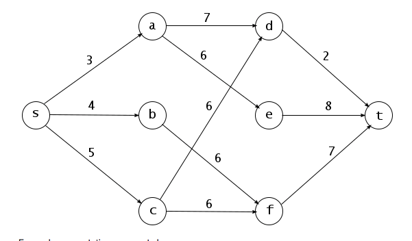

# Directed Acyclic Graph 최단경로 알고리즘

DAG알고리즘은 사이클이 없는 유향 그래프에서 최단 경로를 구하는 알고리즘이다.  




* #### 동작원리

  * 위상정렬을 통해서 각 노드들을 배치한다음 거리를 구하고 더 짧은 거리가 있으면 갱신하며 반복한다.


* #### 구현

  ```c++
  #include <iostream>
  #include <queue>
  #define MAX_VERTEX 8
  #define INF 10000
  
  int shortPath[MAX_VERTEX];
  int graph[MAX_VERTEX][MAX_VERTEX];
  
  int left[MAX_VERTEX];	//남은 것
  
  int main(int argc, char* argv[])
  {
  	//Init
  	for (int i = 0; i < MAX_VERTEX; ++i)
  		shortPath[i] = INF;
  	memset(left, 0, sizeof(left));
  
  	for (int i = 0; i < MAX_VERTEX; ++i)
  		for (int j = 0; j < MAX_VERTEX; ++j)
  			graph[j][i] = INF;
  
  	//Input
  	int v, e;
  	std::cin >> v >> e;
  	for (int i = 0; i < e; ++i)
  	{
  		int a, b, c;
  		std::cin >> a >> b >> c;
  		graph[a][b] = c;
  
  		++left[b];
  	}
  
  	//진행할 친구들만 넣어줌
  	std::queue<int> topologicalSort;
  	for (int i = 0; i < MAX_VERTEX; ++i)
  		if (left[i] == 0)
  		{
  			topologicalSort.push(i);
  			shortPath[i] = 0;
  		}
  
  	while (!topologicalSort.empty())		//위상정렬
  	{
  		int front = topologicalSort.front();
  
  		for (int i = 0; i < MAX_VERTEX; ++i)
  		{
  			if (graph[front][i] != INF)	//갈 수 있으면
  			{
  				//거리 갱신
  				if (shortPath[i] > shortPath[front] + graph[front][i])
  					shortPath[i] = shortPath[front] + graph[front][i];
  				
  				--left[i];
  				if (left[i] == 0)
  					topologicalSort.push(i);
  			}
  		}
  
  		topologicalSort.pop();
  	}
  
  	for (int i = 0; i < MAX_VERTEX; ++i)
  		std::cout << shortPath[i] << " ";
  	std::cout << "\n";
  
  	return 0;
  }	
  ```
  
  
  
* #### 입력값

  ```
  8 11
  0 1 3
  0 2 4
  0 3 5
  1 4 7
  1 5 6
  2 6 6
  3 4 6
  3 6 6
  4 7 2
  5 7 8
  6 7 8
  ```
  
  
  
  
  
* #### 결과

  ```
  0 3 4 5 10 9 10 12
  ```

  
  
* #### 선택된 경로들

  

#### Reference

Image1:[Link](https://www.chegg.com/homework-help/questions-and-answers/-execute-step-step-max-flow-algorithm-find-maximum-flow-s-t-following-graph-given-edge-cap-q20975553)