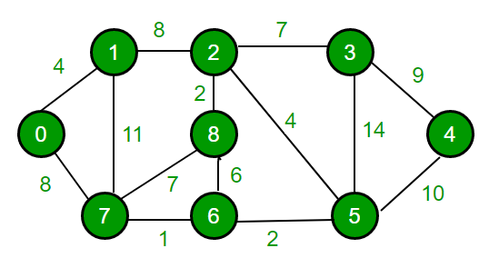

# Dijkstra 최단 경로 알고리즘

임의의 집합 S에 더할 때 r에서 그 정점 까지의 최단거리는 계산이 끝났다는 확신을 가지고 최단거리를 계산하는 방법. 만약 음수가 있다면 이 정의에 모순이 생기기 때문에 음수 가중치를 가지게 되는경우 사용할 수 없다.





* 구현

  첫 시작 노드 거리를 0으로 잡고 다음 노드까지의 거리들을 저장한다. 그 다음 가장 짧은 거리에 있는 노드(A)를 찾아 그 노드에서 인접 노드(B)까지의 거리를 잡는다. 만약 B까지 가는 기존의 거리보다 A까지와서 B까지 가는 거리가 더 짧다면 거리를 갱신한다.

  ```c++
  #include <iostream>
  #include <cstring>
  
  #define INF 10000
  #define MAX_VERTEX 9
  int graph[9][9];
  int dist[9];
  bool checked[9];
  void DijkstraInit(int start)
  {
  	for (int i = 0; i < 9; ++i)
  		for (int j = 0; j < 9; ++j)
  			graph[j][i] = INF;
  	for (int i = 0; i < 9; ++i)
  		dist[i] = INF;
  
  	dist[start] = 0;
  	memset(checked, 0, sizeof(checked));
  }
  
  int findShort(int n)
  {
  	int min = INF, minPos = -1;
  	for (int i = 0; i < n; ++i)
  	{
  		if (dist[i] < min && !checked[i])
  		{
  			min = dist[i];
  			minPos = i;
  		}
  	}
  
  	return minPos;
  }
  
  void Dijkstra(int start, int n)
  {
  	for (int i = 0; i < n-1; ++i)
  	{
  		int u = findShort(n);
  		checked[u] = true;
  		for (int j = 0; j < n; ++j)
  		{
  			if (!checked[j])
  				if ( dist[j] > dist[u] + graph[u][j])	//u까지 온 거리에서 u에서 j를 통해 
  					dist[j] = dist[u] + graph[u][j];	//간 거리가 기존의 j까지 거리보다 
  		}												//짧다면 바꾼다.
  	}
  }
  
  
  int main(int argc, char* argv[])
  {
  	DijkstraInit(0);
  
  	int n;
  	std::cin >> n;
  
  	for (int i = 0; i < n; ++i)
  	{
  		int a, b, c;
  		std::cin >> a >> b >> c;
  		graph[a][b] = graph[b][a] = c;
  	}
  
  	Dijkstra(0, MAX_VERTEX);
  
  	for (int i = 0; i < MAX_VERTEX; ++i)
  		std::cout << dist[i] << " ";
  	std::cout << "\n";
  
  	return 0;
  }
  ```

  

* 입력

  ```
  14
  0 1 4
  0 7 8
  1 7 11
  1 2 8
  7 8 7
  7 6 1
  2 8 2
  8 6 6
  2 3 7
  2 5 4
  6 5 2
  3 5 14
  3 4 9
  5 4 10
  ```

  

* 결과

  ```
  0 4 12 19 21 11 9 8 14
  ```

  

* 각 이동 거리
  * **0: 0** 거리:0
  * **1: 0 - 1** 거리:4
  * **2: 0 - 1 - 2** 거리:12
  * **3: 0 - 1 - 2 - 3** 거리:19
  * **4: 0 -1 - 2 - 3 - 4** 거리:21
  * **5: 0 - 7 - 6 - 5** 거리: 11
  * **6: 0 - 7 - 1** 거리: 8
  * **7: 0 - 1 - 2 - 8** 거리: 14
