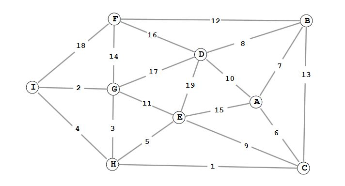

# Prim 최단 경로 알고리즘

Prim 최단 경로 알고리즘은 그래프에 존재하는 모든 정점 사이의 최단 경로를 한 번에 모두 찾아주는 알고리즘 




* #### 동작원리

  * 시작 정점에서 출발하여 신장 트리의 집합을 단계적으로 확장해 나가는 방법
  * Kruskal은 최소 간선 순서대로 선택하지만 Prim알고리즘은 만들어진 트리에서 고른다. 
  * 연결이 되지 않은 부분은 INF로 표기하여 표시한다.
  * O(N^2)을 가진다. 정점 n개만큼 n번 반복하기 때문이다 따라서 그래프 밀집도가 높으면 Prim이 Kruscal보다 적합 할 수는 있음.


* #### 구현

  ```c++
  #include <iostream>
  #include <cstring>
  
  int graphWeight[10 + 1][10 + 1];
  bool selected[10 + 1];
  int dist[10 + 1];
  #define INF 10000			//최대값=연결안됨
  #define MAX_VERTEX	9
  
  void PrimInit()				//초기화 함수
  {
  	for (int i = 1; i <= MAX_VERTEX; ++i)
  		for (int j = 1; j <= MAX_VERTEX; ++j)
  			graphWeight[j][i] = INF;
  
  	for (int i = 1; i <= MAX_VERTEX; ++i)
  	{
  		selected[i] = false;
  		dist[i] = INF;
  	}
  
  	dist[1] = 0;
  }
  
  int GetMinVertext(int n)	//정점 중에서 선택 된적없고 가장 짧은 거리를 고름
  {
  	int v = 1;
  	for (int i = 1; i <= n; ++i)	//선택 안된것을 고름
  		if (!selected[i])
  		{
  			v = i;
  			break;
  		}
  
  	for (int i = 1; i <= n; ++i)	//선택 안된것중 제일 작은것을 고름
  		if (!selected[i] && dist[i] < dist[v])
  			v = i;
  	
  	return v;
  }
  
  void Prim(int start, int n)
  {
  	for (int i = 1; i <= n; ++i)
  	{
  		int u = GetMinVertext(n);
  		selected[u] = true;
  		if (dist[u] == INF)
  			return;
  
  		std::cout << u << " ";
  
  		for (int v = 1; v <= n; ++v)
  			if (graphWeight[u][v] != INF)
  				if (!selected[v] && graphWeight[u][v] < dist[v])
  					dist[v] = graphWeight[u][v];
  		//dist에 더 짧은 거리를 갱신해 준다. 즉, 새로 찾은 edge를 등록해주는 과정이다.
  		//다른 자료구조를 통해서 새로 들어오는 edge들을 넣을 수 있지만
  		//배열을 이용하면 공간을 유지하며 기록할 수 있다.
  	}
  }
  
  
  int main(int argc, char* argv[])
  {
  	PrimInit();
  
  	int n;
  	std::cin >> n;
  	for (int i = 0; i < n; ++i)
  	{
  		int a, b, c;
  		std::cin >> a >> b >> c;
  		graphWeight[a][b] = graphWeight[b][a]= c;
  	}
  
  	Prim(1, MAX_VERTEX);
  
  	return 0;
  }
  ```
  
  
  
* #### 입력값

  ```
  19
  9 6 18
  9 7 2
  9 8 4
  6 7 14
  8 7 3
  6 4 16
  7 4 17
  7 5 11
  8 5 5
  4 5 19
  4 1 10
  5 1 15
  4 2 8
  1 2 7
  5 3 9
  1 3 6
  6 2 12
  8 3 1
  2 3 13
  ```

  

  

* #### 결과

  ```
  1 3 8 7 9 5 2 4 6	//이 순서로 정점을 선택함 
  ```

  
  
* #### 선택된 경로들

  .jpg)

#### Reference

Image1:[Link](//https://subscription.packtpub.com/book/application_development/9781788833738/6/ch06lvl1sec48/minimum-spanning-tree)