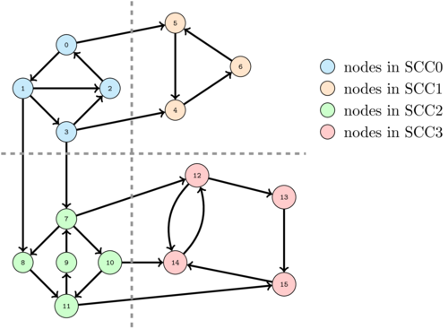

# Strong Connected Components(강연결 요소)

G=(V,E)에서 V의 모든 정점 쌍(u,v)에 대해서 경로 u->v와 v->u가 존재하면 G는 강하게 연결되었다고 말한다. 즉, 어떤 두 정점을 잡더라도 양방향으로 서로에게 이르는 경로가 존재하면 강하게 연결되어있다고 한다.





* 동작원리

  * 그래프 G에 대해 DFS를 수행하여 각 정점 v의 완료시간 f[v]를 계산한다.(한 변의 DFS로 끝나지 않으면 남은 정점 중 아무거나 시작점으로 잡아 DFS를 반복한다.)

  * G의 모든 간선들의 방향을 뒤집어 준다.

  * 뒤집어진 G에 대해 DFS를 수행하되 구한 f[v]값중에서 가장 큰 정점으로 잡는다.

  * 만들어진 분리된 강연결 요소로 리턴한다.

    

* 구현

  ```c++
  #include <iostream>
  #include <cstring>
  #include <vector>
  #define MAX_VERTEX 20
  
  bool graph[MAX_VERTEX][MAX_VERTEX];
  bool reversegraph[MAX_VERTEX][MAX_VERTEX];
  int numbering[MAX_VERTEX + 1];
  int counter = 0;
  bool checker[MAX_VERTEX];
  bool isPushed[MAX_VERTEX];
  
  void dfs(int start, int maxV)
  {
  	for (int i = 0; i < maxV; ++i)
  		if (graph[start][i] && !checker[i] && !isPushed[i])
  		{
  			checker[i] = true;
  			dfs(i, maxV);
  			checker[i] = false;
  		}
  
  	if (!isPushed[start])
  	{
  		isPushed[start] = true;
  		numbering[counter++] = start;
  	}
  }
  
  
  std::vector<std::vector<int>> answer;
  void merge(std::vector<int>& vec, int start, int maxV)
  {
  	if (!checker[start])
  	{
  		vec.push_back(start);
  		checker[start] = true;
  	}
  
  	for (int i = 0; i < maxV; ++i)
  		if (!checker[i] && reversegraph[start][i])
  		{
  			
  			merge(vec, i, maxV);
  		}
  }
  
  int main(int argc, char* argv[])
  {
  	memset(graph, 0, sizeof(graph));
  	memset(numbering, -1, sizeof(numbering));
  	memset(checker, 0, sizeof(checker));
  	counter = 0;
  
  	int v, e;
  	std::cin >> v >> e;
  
  	for (int i = 0; i < e; ++i)
  	{
  		int a, b;
  		std::cin >> a >> b;
  		graph[a][b] = true;
  		reversegraph[b][a] = true;
  	}
  
  	//번호 할당
  	for (int i = 0; i < v; ++i)
  		if (!isPushed[i])
  			dfs(i, v);
  
  	//큰 숫자부터 탐색하며 분리해줌.
  	memset(checker, 0, sizeof(checker));
  	for (int i = v - 1; i >= 0; --i)
  	{
  		if (!checker[numbering[i]])
  		{
  			std::vector<int> vec;
  			merge(vec, numbering[i], v);
  			if(vec.size())
  				answer.push_back(vec);
  		}
  	}
  
  	std::cout << "group Count = "<<answer.size() << "\n";
  	for (int i = 0; i < answer.size(); ++i)
  	{
  		std::cout << i << " : ";
  		for (int j = 0; j < answer[i].size(); ++j)
  			std::cout << answer[i][j] << " ";
  		std::cout << "\n";
  	}
  
  
  	return 0;
  }
  ```

  

* 입력

  ```
  16 26
  0 1
  0 5
  1 2
  1 3
  1 8
  2 0
  3 2
  3 4
  3 7
  4 6
  5 4
  6 5
  7 8
  7 10
  7 12
  8 11
  9 7
  10 11
  10 14
  11 9
  11 15
  12 14
  12 13
  13 15
  14 12
  15 14
  ```

  

  

* 출력

  ```
  group Count = 4
  0 : 1 0 2 3
  1 : 7 9 11 8 10
  2 : 15 13 12 14
  3 : 5 6 4
  ```

  

# Reference

Image: [Link](https://inginious.org/course/competitive-programming/graphs-scc)