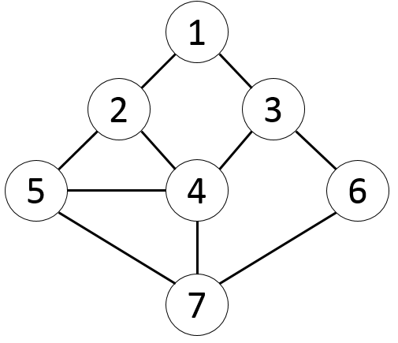

# 그래프의 탐색

1. ### Depth First Search : DFS(깊이 우선 탐색)

   * 한방향으로 진행하다가 더 이상 갈 수 없게 되면 다시 가장 가까운 갈림길로 돌아와서 다른방향으로 다시 탐색을 진행하는 방법

   * 탐색을 진행하면서 그 노드를 탐색하였는지 표시해주면서 진행한다.

   * 완전히 탐색이 일어난 뒤에는 Backtracking을 통해서 이전 갈림길로 돌아가 탐색을 한다.(재귀함수나 Stack 사용)

     

     전체 경로 경우를 다 얻기 위해서는 1 -> 3 -> 6 -> 7 -> 5 -> 2 -> 4 가 된 다음 모두를 탐색했다고 생각하면 backtracking을 해서 5까지 물러 나서 1 -> 3 -> 6 -> 7 -> 4 - > 2 로 탐색하고 이를 반복한다.
     
   * 코드

     ```C++
     //위 그래프의 DFS 탐색
     //시작점은 1
     #include <iostream>
     #include <algorithm>
     #include <cstring>
     #include <vector>
     
     bool graph[7 + 1][7 + 1];
     bool checker[7 + 1];
     
     std::vector<int> path;
     bool isEnd = false;
     void dfs(int current,int count)
     {
     	if (isEnd) return;
     
     	if (count == 7)	//총 Vertex는 7개
     	{
     		int printCount = path.size();
     		for (int i = 0; i < printCount; ++i)
     			std::cout << path[i] << ' ';
     		std::cout << "\n";
     		isEnd = true;
     		return;
     	}
     
     
     	for (int i = 1; i < 7 + 1; ++i)
     	{
     		if (graph[current][i] && !checker[i])	//간선도 연결되어있고 방문도 안했으면
     		{
     			path.push_back(i);
     			checker[i] = true;
     			dfs(i, count + 1);
     			checker[i] = false;
     			path.pop_back();
     		}
     	}
     }
     
     
     int main(int argc, char* argv[])
     {
     	memset(graph, 0, sizeof(graph));
     	memset(checker, 0, sizeof(checker));
     
     	graph[1][2] = graph[1][3] = true;
     	graph[2][1] = graph[2][4] = graph[2][5] = true;
     	graph[3][1] = graph[3][4] = graph[3][6] = true;
     	graph[4][2] = graph[4][3] = graph[4][7] = true;
     	graph[5][2] = graph[5][4] = graph[5][7] = true;
     	graph[6][3] = graph[6][7] = true;
     	graph[7][4] = graph[7][5] = graph[7][6] = true;
     
     	path.push_back(1);
     	checker[1] = true;
     	dfs(1,1);
     
     	return 0;
     }
     ```

   * 결과

     ```
     //출력
     1 2 4 3 6 7 5
     ```

     

   * 특징

     * 모든 경로를 조사할 수 있다. 
     * 시간이 약 O(n^2)이다(인접 행렬 기준), 연결리스트를 사용한다면 O(n+e)의 속도를 가진다. 단 e는 간선의 수.

     

2. ### Breadth First Search : DFS(깊이 우선 탐색)

   * 시작 정점으로 부터 가까운 정점을 먼저 방문하고, 멀리 떨어져 있는 정점을 나중에 방문하는 순회 방법

   * 탐색을 진행하면서 그 노드를 탐색하였는지 표시해주면서 진행한다.

   * 첫 노드에서 인접한 노드 모두를 탐색한 뒤 그 다음 노드들을 진행한다(Queue를 사용)

     

     1을 탐색 한 뒤, 바로 가까운 2와 3을 탐색한다. 이를 반복하여 모든 노드를 방문하면 끝.

   * 코드

     ```c++
     #include <iostream>
     #include <queue>
     #include <vector>
     
     bool graph[7 + 1][7 + 1];
     bool checker[7 + 1];
     std::vector<int> path;
     
     int main(int argc, char* argv[])
     {
     	memset(graph, 0, sizeof(graph));
     	memset(checker, 0, sizeof(checker));
     
     	graph[1][2] = graph[1][3] = true;
     	graph[2][1] = graph[2][4] = graph[2][5] = true;
     	graph[3][1] = graph[3][4] = graph[3][6] = true;
     	graph[4][2] = graph[4][3] = graph[4][7] = true;
     	graph[5][2] = graph[5][4] = graph[5][7] = true;
     	graph[6][3] = graph[6][7] = true;
     	graph[7][4] = graph[7][5] = graph[7][6] = true;
     
     	std::queue<int> bfs;
     	bfs.push(1);
     	checker[1] = true;
     	path.push_back(1);
     
     	while (!bfs.empty())
     	{
     		int front = bfs.front();
     
     		for (int i = 0; i < 7 + 1; ++i)
     		{
     			if (!checker[i] && graph[front][i]) //방문은 안하고 간선은 연결됨.
     			{
     				path.push_back(i);
     				checker[i] = true;
     				bfs.push(i);
     			}
     		}
     
     		bfs.pop();
     	}
     
     	int printCount = path.size();
     	for (int i = 0; i < printCount; ++i)
     		std::cout << path[i] << " ";
     	std::cout << "\n";
     
     	return 0;
     }
     ```

   * 결과

     ```
     1 2 3 4 5 6 7
     ```

     

   * 특징

     * 시간이 약 O(n^2)이다(인접 행렬 기준), 연결리스트를 사용한다면 O(n+e)의 속도를 가진다. 단 e는 간선의 수.
