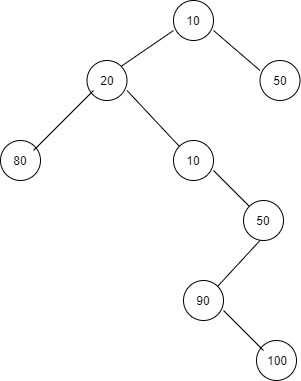
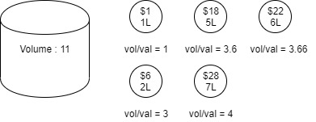
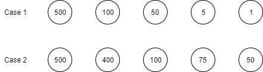
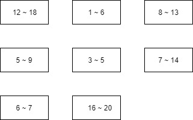

# Greedy Algorithm (그리디 알고리즘)

눈앞의 이익만 우선 추구하는 알고리즘을 총칭해서 부르는 이름.


*  의사코드

  ```C++
  do
  {
      //가장 좋아 보이는 선택을 함.
  }while(!최적해 찾음)
  ```


## 그리디 알고리즘으로 최적해가 보장되지 않는 예.

1. #### 이진 트리의 최적합 경로 찾기

   트리를 탐색하며 가장 큰 가중치를 갖는 경로를 찾는 문제

   

   ```c++
   int GreedyGraph(TreeNode* root, int degree)
   {
   	int sum = 0;
   	TreeNode* currentPos = root;
   	while (Not currentPos is leafNode)
   	{
   		sum += currentPos->nodevalue;
   		current = maxValueNode in ChildNode;
   	}
   
   	return sum;
   }
   ```

   위 의 코드에 따라서 탐색을 하게되면 10 - 50의 순서로 탐색하게 되지만 최적의 해는 10 - 20 - 10 - 50 - 90 - 100으로 탐색했을 때 나타난다. 따라서 이진트리 최적합 경로에서는 DFS, BFS알고리즘등을 이용하여 모든 노드들을 다 확인했을 때 최대의 값을 찾아낼 수 있다.

   

2. #### Knapsack 문제

   부피가 M인 보따리에 넣으려 하는 물건 n개가 있을 때 각 물건의 부피와 가치를 고려하여 사치가 최대가 되도록 넣는 문제

   
   
   ```c++
      Stuff stuffList[8];
      
      int GreedyNapsack(int size, int sackMaxVolume)
      {
      	int volume = 0;
      	sort(stuffList, stuffList + size, order by(volume / price));
      	
      	for (int i = 0; i < size; ++i)
      	{
      		if (sackMaxVolume > volume + stuffList[i])
      			break;
      
      		volume += stuffList[i];
      	}
      	
      	return volume;
      }
   ```
   
   
   
   정렬한 다음 큰 순서 대로 뽑으면 (28$, 7L), (6$, 2L), (1$, 1L)을 뽑게되어 총 35$의 가치를 뽑을 수 있다. 하지만  (22$, 6L), (18$, 5L) 2가지를 뽑게되면 


   

3. #### 동전바꾸기 문제

   특정 가격을 최소 개수의 동전을 이용해서 지불하려고 할때 최소 개수 값은 몇 개인지를 알아내는 문제

   

   

   ```c++
   #include <iostream>
   
   int coins[5] = { 500,100,50,5,1 };
   
   int GreedyCoin(int price)
   {
   	int count = 0;
   	for (int i = 0; i < 5; ++i)
   	{
   		count += price / coins[i];
   		price %= coins[i];
   	}
   	
   	return count;
   }
   ```

   

   ##### 1300원을 쪼갠다고 했을 때)

   * **Case1**의 경우엔 500원 2개, 100원 3개일 때 가장 최소 개수 5개가 됨.
   * **Case2**의 경우 같은 방법을 적용하면 500원 2개 100원 3개해서 5개라는 같은 값이 나온다.
   * 하지만 **Case2**를 이용할 떄는 400원 3개 100원 1개해서 4개라는 더 작은 값이 있다.


​		

## 그리디 알고리즘으로 최적해가 보장되는 예.

1. #### 최소 신장트리

   플로이드 워셜 알고리즘[Link](https://github.com/kiheyunkim/Algorithm/blob/master/Graph/Floyd-Warshall 최단 경로 알고리즘.md), 크루스칼 알고리즘[Link](https://github.com/kiheyunkim/Algorithm/blob/master/Graph/Kruscal 최단 경로 알고리즘.md)

   

   

2. #### 회의실 배정 문제

   회의 시간을 미리 받아서 스케줄링을 할때 가장 많은 스케줄을 받았을 때의 개수를 최대로 하려하는 경우

   -> 종료시간이 빠른 순서로 정렬한 다음 겹치지 않도록 뽑아내면 가장 최적의 답을 얻을 수 있다.

   

   

   

   ```c++
   #include <iostream>
   #include <vector>
   #include <algorithm>
   #include <cstring>
   
   std::vector<std::pair<int, int>> times(8);
   bool checker[24 + 1];		//이미 할당 됐는지 체크
   bool Compare(const std::pair<int, int>& left ,const std::pair<int, int>& right)
   {
   	if (left.second < right.second)
   		return true;
   	else
   		return false;
   }
   
   int main(int argc, char* argv[])
   {
   	memset(checker, 0, sizeof(checker));
   
   	int count = 0;
   	int n;
   	std::cin >> n;
   
   	for (int i = 0; i < n; ++i)
   		std::cin >> times[i].first >> times[i].second;
   	std::sort(times.begin(), times.end(), Compare);
   
   	for (int i = 0; i < times.size(); ++i)
   	{
   		bool isOk = true;
   		for (int j = times[i].first; j <= times[i].second; ++j)	//겹치는 부분이 있는가?
   		{
   			if (checker[j])
   			{
   				isOk = false;
   				break;
   			}
   		}
   
   		if (!isOk) continue;
   
   		for (int j = times[i].first; j <= times[i].second; ++j)	//겹치지 않으면 등록
   			checker[j] = true;
   
   		++count;
   	}
   
   	std::cout << count << "\n";
   
   	return 0;
   }
   /*
   //입력값
   8
   3 5
   1 6
   6 7
   5 9
   16 20
   12 18
   8 13
   7 14
   */
   ```

   