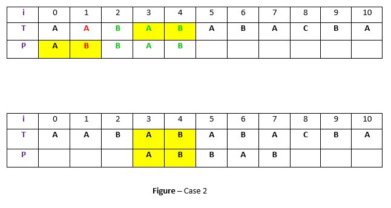

# Boyer-Moore Algorithm(Good Suffix heuristic)

한글자 한글자 모두 비교하는 것이 아니라 중간을 비교할 필요가 없으면 할 필요 없는 부분을 뛰어 넘어서 비교하는 방법이다.  Good Suffix heuristic방법은 반복되는 패턴을 찾고 현재 위치에서 맞지 않으면 다음 패턴이 발견되는 곳으로 뛰어 넘은 다음 비교하는 방법이다.




* ### 구현

  setTable 함수를 통해서 불일치가 일어났을 경우에 얼마나 당겨야 하는지는  move배열에 기록한다. 체크를 하는 동안 불일치가 발생하면 이 배열을 이용해서 당긴다.

  ```c++
  #include <iostream>
  #include <cstring>
  #include <string>
  
  int pie[20];
  void MakePie(const char* pattern, int length)
  {
  	memset(pie, 0, sizeof(pie));
  
  	int j = 4;
  	for (int i = 4; i >= 0; --i)
  	{
  		while (j < length-1 && pattern[i] != pattern[j])
  			j = pie[j - 1];
  
  		if (pattern[i] == pattern[j])
  			pie[j] = j--;
  	}
  }
  
  void BoyerMooreGood(const char* str, const char* pattern)
  {
  	int strLen = strlen(str), patternLen = strlen(pattern);
  
  	MakePie(pattern, patternLen);
  	for (int i = patternLen - 1; i < strLen;)
  	{
  		int iPivot = i;
  		bool isMatched = true;
  		for (int j = patternLen - 1; j >= 0; --j) 	//뒤에서부터 비교
  		{
  			if (pattern[j] == str[iPivot])	//같으면 반복
  				--iPivot;
  			else
  			{
  				isMatched = false;
  				i = iPivot + (4 - pie[str[iPivot] - 'a'] == 0 ? 1 : 4 - pie[str[iPivot] - 'a']);
  				break;
  			}
  		}
  
  		if (isMatched)
  		{
  			std::cout << "end matchStart at " << i - patternLen + 1 << "\n";
  			break;
  		}
  	}
  }
  
  int main(int argc, char* argv[])
  {
  	std::string str, pattern;
  	std::cin >> str >> pattern;
  
  	BoyerMooreGood(str.c_str(), pattern.c_str());
  
  	return 0;
  }
  ```

  

  

* 입력

  ```
  aabababacba abbab
  ```

  

  

* 출력

  ```
  출력 없음
  ```

  

