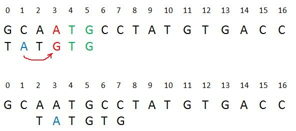

# Boyer-Moore Algorithm(Pattern Searching)

한글자 한글자 모두 비교하는 것이 아니라 중간을 비교할 필요가 없으면 할 필요 없는 부분을 뛰어 넘어서 비교하는 방법이다.  Pattern Searching방법은 맞을 것이라고 생각하고 당긴다음(틀린 부분이 발견되면 일치하는 부분까지 끌어당긴 다음) 비교하는 방법이다.




* ### 구현

  setTable 함수를 통해서 불일치가 일어났을 경우에 얼마나 당겨야 하는지는  move배열에 기록한다. 체크를 하는 동안 불일치가 발생하면 이 배열을 이용해서 당긴다.

  ```c++
  int move[26];
  void setTable(const char* pattern, int length)
  {
  	memset(move, 0, sizeof(move));
  	for (int i = 0; i < length; ++i)
  		if (move[pattern[i] - 'a'] == 0)
  			move[pattern[i] - 'a'] = length - i - 1;
  }
  
  //뒤에서 부터 비교하다가 불일치 하는 부분이 발견되면
  //즉시 일치하는 부분까지 끌어당긴다음 다시 뒤에서 부터 비교한다.
  
  void BoyerMooreBad(const char* str, const char* pattern)
  {
  	int strLen = strlen(str), patternLen = strlen(pattern);
  
  	setTable(pattern, patternLen);
  
  	for (int i = patternLen - 1; i < strLen;)
  	{
  		int iPivot = i;
  		bool isMatched = true;
  		for (int j = patternLen - 1; j >= 0; --j) 	//뒤에서부터 비교
  		{
  			if (pattern[j] == str[iPivot])	//같으면 반복
  				--iPivot;
  			else
  			{
  				isMatched = false;
  				i = iPivot + (move[str[iPivot] - 'a'] == 0 ? 1 : move[str[iPivot] - 'a']);
  				break;
  			}
  		}
  
  		if (isMatched)
  		{
  
  			std::cout << "end! matchStart at " << i - patternLen + 1 << "\n";
  			break;
  		}
  	}
  }
  
  int main(int argc, char* argv[])
  {
  	std::string str, pattern;
  	std::cin >> str >> pattern;
  
  	BoyerMooreBad(str.c_str(), pattern.c_str());
  
  	return 0;
  }
  ```

  

  

* 입력

  ```
  gcaatgcctatgtgacc tatgtg
  ```

  

  

* 출력

  ```
  end! matchStart at 8
  ```

  

