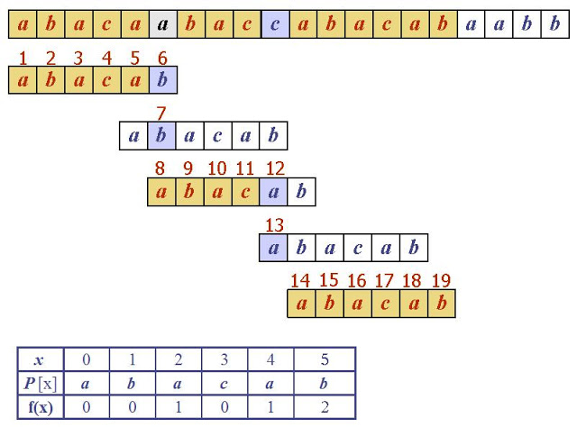

# Knuth-Morris-Pratt(KMP 알고리즘)

비교한 부분에 대해서는 더이상 비교를 하지 않는다는 것으로 만들어진 알고리즘.  반복되는 부분(반복되는 패턴)에 대해서 당겨가면서 비교를 한다.




* ### 구현

  MakePie 함수를 통해서 pattern에 대한 패턴을 구해준다. pi는 KMP알고리즘을 진행하는 동안 그 자리에서 비교중에 다른 문자가 나왔을 때 어디로 이동을 해서 다시 비교를 시작할 지에 대해서 알려준다. KMP알고리즘을 진행하면서는 pi를 이용한다. 만약 다른 부분이 나오면 패턴을 이동시킨 위치부터 비교해주고 비교 뒤에 

  

  ```c++
  #include <iostream>
  #include <cstring>
  #include <string>
  
  int pi[20];
  void MakePie(const char* pattern,int length)
  {
  	memset(pi, 0, sizeof(pi));
  
  	int j = 0;										//패턴 매칭위치 = 어디까지 매치되었는가?
  	for (int i = 1; i < length; ++i)				//패턴 전체를 탐색하는동안
  	{
  		while (j > 0 && pattern[j] != pattern[i])	//현재의 i위치에서와 
  			j = pi[j - 1];							//패턴 매칭이 안된 위치 한칸 앞이므로 
  													//-1시킨 위치로 이동
  													//이전 같은 패턴위치를 찾는다.
  		if (pattern[i] == pattern[j])				//i위치에서 j위치와 같다는건 패턴이 같다는 것
  			pi[i] = j++;							//어디까지 맞는가 증가시킴
  	}
  }
  
  int KMP(const char* str, const char* pattern)
  {
  	int strLen = strlen(str), patternLen = strlen(pattern);
  	MakePie(pattern, patternLen);
  
  	int j = 0;		//비교 지점
  	for (int i = 0; i < strLen; ++i)
  	{
  		if(str[i] != pattern[j])            //아닌 경우를 만나면
  			j = pi[j];
  
  		if (str[i] == pattern[j])			//동일하면 증가시킴
  			++j;		
  		
  		if (j == patternLen)				//찾음
  			return  i - patternLen + 1;
  	}
  }
  
  int main(int argc, char* argv[])
  {
  	std::string str, pattern;
  	std::cin >> str >> pattern;
  
  	std::cout << KMP(str.c_str(), pattern.c_str()) << "\n";
  
  	return 0;
  }
  ```


* ### 입력

  ```
  abacaabaccabacabaabb abacab
  ```

  

* ### 출력

  ```
  10
  ```

  


# Reference

image1 : [Link](http://i-satyam.blogspot.com/2015/12/knuth-morris-pratt-algorithm.html)