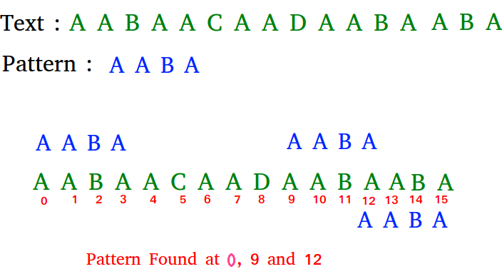

# Rabin-karp 알고리즘

문자열 패턴을 수치(숫자)로 바꾸어 문자열 비교 대신에 수치 비교를 해서 시간을 줄인다. a-z의 각각의 값을 0-
26에 매칭시키고 각 자리의 진수에 배치해서 숫자를 만든다음 숫자를 만든다.





* ### 구현 


  패턴을 숫자화 시키고 원문에 비교할 부분을 숫자로 만들어준다. 하지만 원문의 비교할 부분을 계속 숫자로 만든다면 계속 비교하는 것과 차이가 없어진다. 그렇기에 계산 식을 줄여주기 위하여

  ```
  (현재숫자/26) + (다음 추가할 문자 - 'a') * 26^( 비교문자길이 -1 )
  ```

  를 이용하여 계산 과정을 줄인다.

  ```c++
  #include <iostream>
  #include <cstring>
  #include <cmath>
  
  char entireStr[100];
  char findStr[10];
  
  int main(int argc, char* argv[])
  {
  	std::cin >> entireStr;
  	std::cin >> findStr;
  
  	int entireLen = strlen(entireStr);
  	int findLen = strlen(findStr);	
  
  	unsigned long long int findNum = 0;		//찾는 문자 숫자화
  	for (int i = 0; i < findLen; ++i)
  		findNum += (findStr[i] - 'a') * powl(26, i);
  
  	unsigned long long int compareNum = 0;
  	for (int i = 0; i < findLen; ++i)		//전체 문자에서 찾는 부분 초기
  		compareNum += (entireStr[i] - 'a') * powl(26, i);
  
  	int i = findLen - 1;
  	bool isFind = false;
  	do
  	{
  		if (findNum == compareNum)
  		{
  			isFind = true;
  			break;
  		}
  		//p(n) = 새로운 값 * pow(26,findLen-1) +(p(n-1) - 마지막 원소) /26
  		++i;					//전진
  		compareNum /= 26;		//전체의 차수를 줄여줌
  		compareNum += (entireStr[i] - 'a') * pow(26, findLen - 1);
  	} while (i<entireLen);
  
  	std::cout << (isFind ? "Find" : "Not Find") << "\n";
  
  	return 0;
  }
  ```

  

* ### 입력

  ```
  aabaacaadaabaaba
  aaba
  ```

  

* ### 출력

  ```
  Find
  ```

  

* ### 문자열 비교 과정.

  ```
  676		//찾는 문자
  676		//아래로 전체 문자의 일부를 수치화
  26
  35153
  1352
  52
  52730
  2028
  78
  17579
  676
  26
  17577
  676
  ```

  

* ### 단점

  오버플로가 일어날 확률이 있다. 자리마다 26의 제곱수를 사용하고 있으므로 찾는 문자열의 길이가 길어진 다면 오버플로가 일어 날 수 있다.

